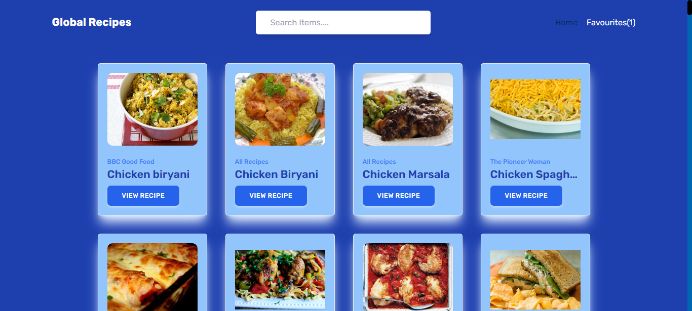
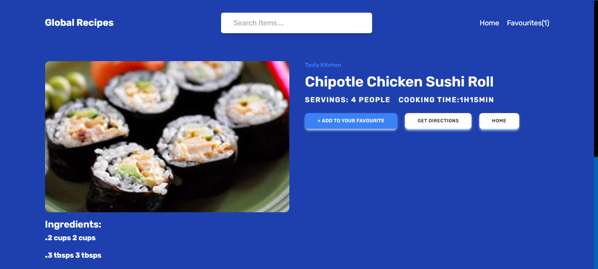
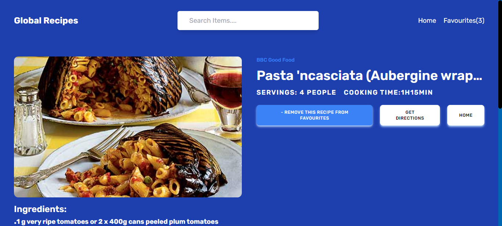

# Global Recipes

- Global recipes is a recipe hub which utilizes Forkify api to bring users the details of their favorite meals.

# Features

- Responsive UI
- Unlimited searching for foods which brings back their description and ingredients.
- Includes a favorite page where the users store there favorite recipes.

# Tools Used

- ReactJS library for the entire UI
- React Router for routing between the pages
- Data fetching
- Tailwind CSS

# Screenshots

